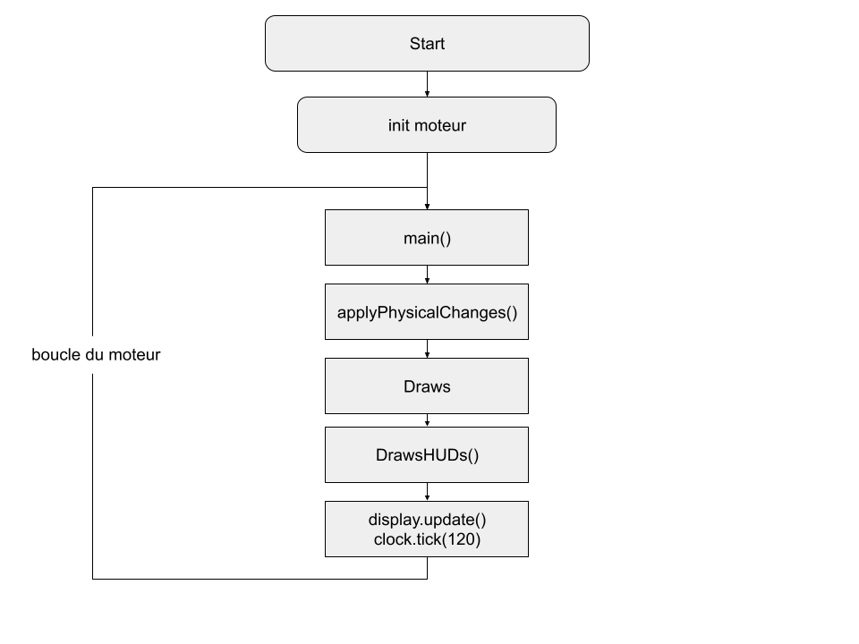

# Projet jeu 2d en python et pygame
Jeu d'aventure RPG en vue de dessus 

But:
 - faire des quetes 
 - avoir du meilleur equipements
 - gagner de l'expérience
 - avancer dans le jeu

But final : avoir battu les 5 bosses du jeu

## Utilisation:
 - pygame installé 
 - vous pouvez changer les parametres graphiques (scale multiplier, HUD scale multiplier) dans config.json
 - lancer game.py
 - Touches:
    - haut,bas,gauche,droite -> z,s,q,d
    - sprinter -> maj gauche
    - attaque -> espace
    - inventaire -> i (ou click sur la 'main' en haut a droit)

## Fonctionalité:
 - affichage moderne du jeu (fenetre réglable)
 - collision avec le monde
 - déplacement du perso dans les 4 directions
 - camera suivant le perso
 - perso peut sprinter (utilise de l'énergie)
 - animation du perso dans les 4 directions
 - systeme de 'main' et d'inventaire 
 - peut ramaser object au sol
 - perso peut attaquer
 - animation attaque avec l'arme équipé dans la 'main'
 - degat affliger au monstre en fonction des statistiques de l'arme equipé
 - monstre avec systeme de pv et de collision
 - monstre déplace dans 4 direction + animation
 - monstre suit le joueur
 - HUD d'inventaire
 - HUD pv des monstres au dessus d'eux

## Dossiers:
 - gregngine : dossier moteur de jeu perso
 - entities : dossier contenant l'inititialisation de chaque entité au format .json (image,attaque de base, vitesse, etc..)
 - items : dossier contenant les infos de chaque item au format .json
 - saves : dossier contenant les fichiers de sauvegardes
 - sprites : dossier contenant les differents images 
 - pickle5 : dossier contenant la derniere version de pickle pour assurer la compatibilité entre python 3.8 et 3.6

## Gregngine:
Gregngine est le moteur de jeu réaliser pour crée des jeux en 2d et en vue de dessus.
Il s'occupe de la gestion des entitées (perso,ennemies,items ...), de la physique et de l'affichages des elements et HUDs.
Il contient tout ce qui est réutilisable et non propre au projet actuelle.

## Flow :

- main() -> appelle la fonction main a chaque frame
- applyPhysicalChanges() -> applique la physique a chaque entitées, pour chaque entitées, leur fonction .move() est appelée
- Draws() -> appelle pour chaque entitées visible leur fonction .draw()
- DrawHUDs -> appelle pour chaque entitées visible leur fonction .drawHUD()
- clock.tick(120) -> bloque le jeu a 120 fps
